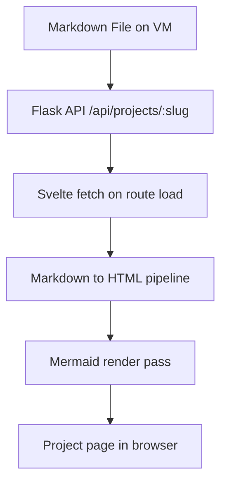

## Why I built this

I wanted to update project write-ups on my VM without rebuilding frontend assets.

That means content should live outside the Svelte build and be loaded dynamically at runtime.

## Architecture

- Markdown files are stored in the backend.
- The backend exposes a project list and a project detail endpoint.
- The frontend fetches Markdown and renders it in the browser.
- Mermaid diagrams are converted from code fences and rendered client-side.

## Data flow

## Notes

This setup keeps deploys simple for content updates:

1. Update a Markdown file.
2. Restart backend only if needed.
3. Refresh the page.
