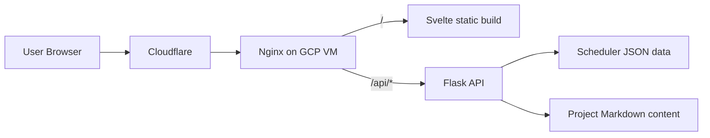
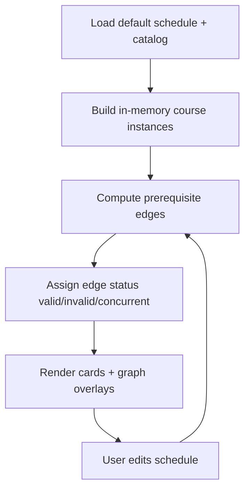

## Overview

This project is my full-stack personal website and ongoing engineering sandbox.

I built it to do more than host static pages. It includes:

- a typed frontend application with route-driven UI,
- a Flask backend with API endpoints for dynamic data,
- infrastructure-as-code deployment on Google Cloud,
- and a feature-rich scheduler utility that uses graph logic to validate prerequisites.

Over time, the repository evolved from a static portfolio into a practical system where I can design features, ship infrastructure changes, and document the architecture in one place.

The most recent iteration added runtime-rendered project write-ups. This means I can publish and update project content by editing Markdown files on the backend without rebuilding frontend assets.

That change reduced editorial friction and made the site feel more like a lightweight content platform instead of a hardcoded front-end build artifact.

## Why I Built It

I wanted one repository that could serve several goals at once:

1. Present my work as a portfolio.
2. Demonstrate practical full-stack architecture decisions.
3. Host a non-trivial interactive tool that exercises data modeling and UI logic.

I also wanted the project to be inexpensive to operate and easy to reason about end-to-end. That drove the choice of a single-VM deployment footprint with clear responsibilities:

- Cloudflare for DNS and edge proxying,
- Nginx for HTTPS and reverse proxy behavior,
- Flask for APIs and content,
- Svelte static output for front-end delivery.

Another goal was technical transparency. I wanted to be able to answer detailed questions such as:

- How is project content modeled and delivered?
- How is scheduler data validated?
- How does deployment happen from source to running service?
- What are the known risks and next architecture improvements?

This write-up is intentionally detailed so it can function as both a portfolio explanation and an engineering handoff document.

## Architecture

### Request Lifecycle

At a high level, user requests follow two paths:

1. Page/navigation requests are handled by the Svelte app bundle served by Nginx.
2. Data requests under /api/* are proxied by Nginx to Flask.

For project detail pages, the browser first loads the SPA route, then fetches project content from the API. Markdown is transformed and rendered client-side.

For scheduler usage, the frontend loads a seeded schedule plus full course catalog data and computes prerequisite state transitions in-browser.

This split keeps backend logic simple while still enabling complex user interaction in the UI.

### Frontend

- Svelte + TypeScript + Vite
- page.js client-side routing
- Runtime project detail rendering pipeline:
  - fetch markdown from backend API
  - parse + sanitize markdown
  - render Mermaid diagrams client-side

#### Frontend Responsibilities

- Route rendering and navigation state
- Loading/error boundaries for API-backed pages
- Scheduler interaction model (drag-and-drop, selection, reordering)
- Graph edge rendering and requirement progress display
- Theme persistence and global visual system

#### Markdown Rendering Pipeline

Project detail pages use a pipeline that supports:

- GFM features such as lists/tables/task syntax,
- heading slug generation and anchor links,
- sanitization before injecting HTML,
- Mermaid code-fence transformation and runtime rendering.

This enables rich technical write-ups without trusting raw HTML from content files.

#### Frontend Tradeoffs

I intentionally moved logic toward the client for responsiveness and lower backend complexity. The downside is higher UI complexity and more care needed around lifecycle timing, graph recomputation, and safe HTML rendering.

### Backend

- Flask application factory + blueprint routing
- Waitress in production
- API endpoints for scheduler data and project content

#### Backend Responsibilities

- Serve scheduler data files with consistent JSON responses
- Parse project markdown frontmatter and return API payloads
- Filter unpublished project entries
- Provide stable contracts consumed by frontend pages

#### Project Content Contract

Each project file includes frontmatter metadata such as:

- title, slug, summary, date
- tags
- repo and optional demo URL
- published flag

The backend exposes:

1. /api/projects for listing metadata
2. /api/projects/:slug for detail payloads including markdown body

This pattern keeps content source-of-truth in versioned Markdown while preserving API-level structure for the frontend.

#### Backend Tradeoffs

The backend is intentionally lightweight. Most transformation and presentation logic happens in the frontend. This keeps Python code concise, but limits server-side control over final rendering behavior.

### Infrastructure

- Terraform-managed GCP VM/network/firewall
- Cloudflare DNS and proxy
- Nginx reverse proxy and static hosting
- systemd service for backend runtime

#### Deployment Model

The deployment is optimized for operational simplicity:

- one VM,
- deterministic startup scripts,
- static frontend output served by Nginx,
- backend process managed by systemd.

Infrastructure and app bootstrapping are codified so rebuilds and VM replacements are repeatable.

#### Operational Benefits

- Lower hosting cost
- Fewer moving parts
- Fast debugging due to clear runtime topology

#### Operational Risks

- Single failure domain
- Manual discipline needed for secret/state hygiene
- Less elasticity than managed multi-service environments

## Feature Spotlight: Scheduler Utility

The scheduler is the most technical user-facing feature in this project.

Core capabilities:

- Semester-based drag-and-drop planning
- Prerequisite validation states (`valid`, `invalid`, `concurrent`)
- Requirement completion progress indicators
- Import/export schedule JSON

Graph behavior is recalculated as users move courses across semesters.

  ### Scheduler Data Model

  The scheduler combines two backend-provided datasets:

  1. A default semester plan
  2. A course catalog with credits and prerequisite groups

  Course entries can encode variable credit requests (for example, COURSE[4]) and are validated during parsing. Catalog records support OR-group prerequisites and concurrent prerequisite groups.

  ### Scheduler Logic Details

  When a schedule is loaded or changed, the frontend:

  1. builds unique in-memory course instances,
  2. maps each course instance to its semester index,
  3. evaluates each requirement group against the current plan,
  4. emits edge states and progress metrics,
  5. re-renders cards and graph overlays.

  Progress for each course reflects satisfied requirement groups divided by expected requirement groups.

  The visual feedback loop is immediate, so users can test schedule moves and understand which prerequisites they break or satisfy.

  ### UX Behaviors

  - deterministic drag-and-drop placement,
  - move earlier/later controls for fine adjustments,
  - add/remove course actions,
  - bulk clear workflow,
  - import/export for portability and backup.

  This feature is intentionally practical, not just decorative, and it demonstrates stateful UI + graph reasoning in a portfolio setting.

## Dynamic Project Content System

A recent improvement was replacing hardcoded project cards/details with API-backed Markdown content.

Current flow:

1. Project files live in backend content directory as Markdown with frontmatter.
2. `/api/projects` returns published metadata for list rendering.
3. `/api/projects/:slug` returns metadata + markdown body.
4. Frontend renders markdown at runtime and executes Mermaid diagrams.

This made project updates much faster because content edits no longer require a frontend rebuild.

### Why This Matters

Before this change, editing project content required changing frontend source and rebuilding the app.

Now, content changes are decoupled from frontend build artifacts. That improves workflow in production:

1. edit Markdown,
2. verify API response,
3. refresh page.

It also made project write-ups significantly richer because diagrams and long-form structure can be authored directly in Markdown.

### Reliability Lessons Learned

Implementing this surfaced a few subtle integration issues:

- sanitize schema needed explicit support for Mermaid container tags,
- lifecycle timing needed to ensure Mermaid runs after rendered content mounts,
- debug instrumentation was useful to isolate each stage (input, transform, DOM, render).

Those lessons are now encoded into the implementation and made the pipeline more robust.

## Challenges and Tradeoffs

### 1) Simplicity vs scalability

A single VM keeps operations straightforward, but it also concentrates failure risk and limits horizontal scaling.

### 2) Rich client behavior vs complexity

The scheduler delivers a responsive UX in-browser, but this increases frontend state and graph-logic complexity.

### 3) Fast content publishing vs rendering surface area

Runtime markdown rendering speeds publishing, but requires careful sanitization and renderer maintenance.

### 4) Fast iteration vs strict guarantees

The project favors iteration speed and practical architecture over enterprise-grade guarantees. This is appropriate for its purpose, but it means durability, observability, and testing depth are still active improvement areas.

### 5) Full-stack breadth vs maintenance cost

Owning frontend, backend, and infrastructure in one repo improves learning and control, but increases maintenance burden. Clear docs and conventions are essential to keep this sustainable.

## Results

- One cohesive repository that demonstrates frontend, backend, and infrastructure capability.
- A working deployment pipeline from Terraform to running app.
- A scheduler feature that shows algorithmic UI behavior beyond static portfolio content.
- A Markdown-based content workflow for project pages that reduces content update friction.

### Practical Outcome Summary

From an engineering perspective, the project now supports:

- dynamic content publishing for project pages,
- a feature-complete interactive utility with non-trivial logic,
- reproducible infrastructure provisioning,
- and documentation that captures architecture, operations, and known gaps.

From a portfolio perspective, it communicates both system design and implementation detail, rather than only visual presentation.

## Performance and Operational Notes

The current architecture emphasizes predictable behavior over aggressive optimization.

Observed strengths:

- simple request path,
- low coordination overhead,
- fast local iteration.

Current constraints:

- no horizontal scaling strategy,
- limited runtime observability,
- no persistent backend state for scheduler edits.

These are acceptable for current scope, but are already tracked as future work.

## Security and Trust Model

Key practices in the current implementation:

- API surface scoped under /api/* with CORS configuration
- markdown sanitization before HTML injection
- deployment-time secret retrieval through infrastructure workflow
- HTTPS termination and reverse-proxy boundary via Nginx/Cloudflare

Areas to strengthen:

- automated checks for API contracts and renderer behavior
- stricter secret/state handling processes
- explicit health and monitoring endpoints

## Future Direction

Near-term direction is to preserve the current simplicity while improving reliability and depth.

Priority candidates:

1. Add automated tests for API contracts, markdown rendering, and scheduler graph logic.
2. Add saved schedule persistence (local-first, then optional backend store).
3. Add health endpoints and minimal monitoring/alerting.
4. Improve deployment hardening and remote state management.
5. Expand write-ups with screenshots and deeper implementation notes per project.

## What I Would Improve Next

1. Add automated tests for backend API contracts, markdown rendering pipeline, and scheduler logic.
2. Add persistent saved schedules (local first, then backend persistence option).
3. Add production health endpoint and lightweight monitoring.
4. Improve terraform state/secrets hygiene.
5. Expand content quality: screenshots, benchmark notes, and architecture diffs for major iterations.
6. Improve About/Contact content and cross-link related project write-ups.
