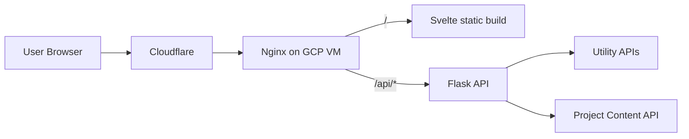

## Overview

This project is a full-stack personal website platform built as an engineering sandbox and portfolio vehicle.

It goes beyond static pages by combining:

- a typed Svelte frontend with route-driven UI and client-side rendering,
- a Flask backend with API endpoints for dynamic content and utilities,
- infrastructure-as-code deployment on Google Cloud with Terraform,
- runtime-rendered Markdown project content decoupled from frontend builds,
- and multiple interactive utilities that demonstrate different problem domains.

The repository serves as one cohesive system where I can design features, iterate on architecture, ship infrastructure changes, and maintain comprehensive documentation—all in one place.

A key architectural decision was replacing hardcoded project content with API-backed Markdown. This decouples content updates from frontend releases, making the site feel like a lightweight content platform rather than a static build artifact.

## Why I Built It

I wanted one repository that could serve several goals at once:

1. Present my work as a portfolio.
2. Demonstrate practical full-stack architecture decisions.
3. Host a non-trivial interactive tool that exercises data modeling and UI logic.

I also wanted the project to be inexpensive to operate and easy to reason about end-to-end. That drove the choice of a single-VM deployment footprint with clear responsibilities:

- Cloudflare for DNS and edge proxying,
- Nginx for HTTPS and reverse proxy behavior,
- Flask for APIs and content,
- Svelte static output for front-end delivery.

Another goal was technical transparency. I wanted to be able to answer detailed questions such as:

- How is project content modeled and delivered?
- How is scheduler data validated?
- How does deployment happen from source to running service?
- What are the known risks and next architecture improvements?

This write-up is intentionally detailed so it can function as both a portfolio explanation and an engineering handoff document.

## Architecture

### Request Lifecycle

At a high level, user requests follow two paths:

1. Page/navigation requests are handled by the Svelte app bundle served by Nginx.
2. Data requests under /api/* are proxied by Nginx to Flask.

For project detail pages, the browser first loads the SPA route, then fetches project content from the API. Markdown is transformed and rendered client-side.

For utility routes, the frontend loads utility-specific data and logic runs in-browser to keep interactions responsive without backend overhead.

This split keeps backend logic simple while still enabling complex user interaction in the UI.

### Frontend

- Svelte + TypeScript + Vite
- page.js client-side routing
- Runtime project detail rendering pipeline:
  - fetch markdown from backend API
  - parse + sanitize markdown
  - render Mermaid diagrams client-side

#### Frontend Responsibilities

- Route rendering and navigation state
- Loading/error boundaries for API-backed pages
- Utility-specific interaction models and state management
- Theme persistence and global visual system

#### Markdown Rendering Pipeline

Project detail pages use a pipeline that supports:

- GFM features such as lists/tables/task syntax,
- heading slug generation and anchor links,
- sanitization before injecting HTML,
- Mermaid code-fence transformation and runtime rendering.

This enables rich technical write-ups without trusting raw HTML from content files.

#### Frontend Tradeoffs

I intentionally moved logic toward the client for responsiveness and lower backend complexity. The downside is higher UI complexity and more care needed around lifecycle timing, graph recomputation, and safe HTML rendering.

### Backend

- Flask application factory + blueprint routing
- Waitress in production
- API endpoints for scheduler data and project content

#### Backend Responsibilities

- Serve utility data files with consistent JSON responses
- Parse project markdown frontmatter and return API payloads
- Filter unpublished project entries
- Provide stable API contracts consumed by frontend pages

#### Project Content Contract

Each project file includes frontmatter metadata such as:

- title, slug, summary, date
- tags
- repo and optional demo URL
- published flag

The backend exposes:

1. /api/projects for listing metadata
2. /api/projects/:slug for detail payloads including markdown body

This pattern keeps content source-of-truth in versioned Markdown while preserving API-level structure for the frontend.

#### Backend Tradeoffs

The backend is intentionally lightweight. Most transformation and presentation logic happens in the frontend. This keeps Python code concise, but limits server-side control over final rendering behavior.

### Infrastructure

- Terraform-managed GCP VM/network/firewall
- Cloudflare DNS and proxy
- Nginx reverse proxy and static hosting
- systemd service for backend runtime

#### Deployment Model

The deployment is optimized for operational simplicity:

- one VM,
- deterministic startup scripts,
- static frontend output served by Nginx,
- backend process managed by systemd.

Infrastructure and app bootstrapping are codified so rebuilds and VM replacements are repeatable.

#### Operational Benefits

- Lower hosting cost
- Fewer moving parts
- Fast debugging due to clear runtime topology

#### Operational Risks

- Single failure domain
- Manual discipline needed for secret/state hygiene
- Less elasticity than managed multi-service environments

## Utilities

The platform hosts multiple interactive utilities that showcase different engineering challenges:

- **Class Scheduler** (`/utilities/scheduler`): Semester-based drag-and-drop planning with prerequisite validation and dependency graph visualization.
- **File Share** (`/utilities/fileshare`): Password-labeled local file sharing with automatic expiration and backend-enforced storage limits.

Each utility is self-contained under its own route, with frontend logic in `frontend/src/lib/<utility>/` and optional backend endpoints under `/api/<utility>/`.

Utility-specific data models, API contracts, and behavior are documented in `documentation/UTILITIES.md`. This pattern makes utilities easy to add, test, and reason about independently while keeping the platform itself generic.

## Dynamic Project Content System

A core architectural decision was replacing hardcoded project cards/details with API-backed Markdown content.

### Why This Matters

Before this change, editing project write-ups required changing frontend source code and rebuilding the SPA.

Now, content changes are fully decoupled from frontend build artifacts:

1. Edit Markdown file in backend content directory.
2. Verify API response (`/api/projects/:slug`).
3. Refresh page in browser.
4. Changes are live.

This workflow dramatically reduces editorial friction and makes the site behave more like a content platform than a static build artifact.

### Technical Implementation

Content flow:

1. Project files live in `backend/app/content/projects/` as Markdown with YAML frontmatter.
2. Frontmatter includes metadata: title, slug, summary, date, tags, repo URL, published flag.
3. `/api/projects` returns published metadata for card/index views.
4. `/api/projects/:slug` returns full metadata plus Markdown body.
5. Frontend fetches, parses, and renders at runtime.

The rendering pipeline:

1. Parse Markdown with GitHub Flavored Markdown (GFM) support.
2. Generate anchor IDs for headings and inject links.
3. Convert Mermaid code fences into placeholder targets.
4. Sanitize HTML to prevent injection attacks.
5. Mount DOM content.
6. Execute Mermaid rendering for diagrams.

This pipeline enables rich technical write-ups (lists, tables, code blocks, diagrams) without trusting raw HTML from content files.

### Reliability Lessons

Implementing this surfaced subtle integration issues:

- Sanitization schema needed explicit support for Mermaid container tags to preserve diagram placeholders.
- Lifecycle timing required ensuring Mermaid executes after rendered content mounted to the DOM.
- Instrumentation at each stage (input validation, parse, sanitize, render) was essential for debugging.

Those lessons are now encoded into the implementation.

## Challenges and Tradeoffs

### 1) Simplicity vs scalability

A single VM keeps operations straightforward, but it also concentrates failure risk and limits horizontal scaling.

### 2) Rich client behavior vs complexity

Utilities compute logic in-browser for responsiveness, but this increases frontend state management and complexity.

### 3) Fast content publishing vs rendering surface area

Runtime markdown rendering speeds publishing, but requires careful sanitization and renderer maintenance.

### 4) Fast iteration vs strict guarantees

The project favors iteration speed and practical architecture over enterprise-grade guarantees. This is appropriate for its purpose, but it means durability, observability, and testing depth are still active improvement areas.

### 5) Full-stack breadth vs maintenance cost

Owning frontend, backend, and infrastructure in one repo improves learning and control, but increases maintenance burden. Clear docs and conventions are essential to keep this sustainable.

## Portfolio Value

This project demonstrates full-stack architecture in a cohesive, deployable system:

**Frontend Architecture**: Shows route-driven SPA design, state management across multiple utilities, safe HTML rendering with sanitization, and runtime Markdown parsing with diagram support.

**Backend Design**: Demonstrates API-first thinking, frontmatter-based content modeling, contract-driven development, and clean separation between data services and presentation logic.

**Infrastructure as Code**: Illustrates single-responsibility VM topology, deterministic bootstrapping with startup scripts, infrastructure versioning, and the tradeoffs between simplicity and scalability.

**Content Platform**: Illustrates how to decouple content updates from code deployments—a practical pattern for portfolio sites, blogs, documentation, and product platforms.

**Integration**: Shows how to connect frontend, backend, and infrastructure into a working system that can be deployed, iterated on, and understood end-to-end.

The project prioritizes clarity and coherence over feature breadth. Every component has a clear responsibility, making it straightforward to understand how a request flows from user browser to running service.

## Results

- One cohesive repository demonstrating frontend, backend, and infrastructure capability.
- A working deployment pipeline from Terraform to running app.
- Multiple interactive utilities showcasing different problem domains and interaction patterns.
- A content platform where write-ups can be published by editing Markdown, without rebuilding the frontend.
- Clear documentation capturing architecture, operations, and future directions.

## Performance and Operational Notes

The current architecture emphasizes predictable behavior over aggressive optimization.

Observed strengths:

- simple request path,
- low coordination overhead,
- fast local iteration.

Current constraints:

- no horizontal scaling strategy,
- limited runtime observability,
- no persistent backend state for scheduler edits.

These are acceptable for current scope, but are already tracked as future work.

## Security and Trust Model

Key practices in the current implementation:

- API surface scoped under /api/* with CORS configuration
- markdown sanitization before HTML injection
- deployment-time secret retrieval through infrastructure workflow
- HTTPS termination and reverse-proxy boundary via Nginx/Cloudflare

Areas to strengthen:

- automated checks for API contracts and renderer behavior
- stricter secret/state handling processes
- explicit health and monitoring endpoints

## Future Direction

Near-term direction is to preserve the current simplicity while improving reliability and depth.

Priority candidates:

1. Add automated tests for API contracts, markdown rendering, and scheduler graph logic.
2. Add saved schedule persistence (local-first, then optional backend store).
3. Add health endpoints and minimal monitoring/alerting.
4. Improve deployment hardening and remote state management.
5. Expand write-ups with screenshots and deeper implementation notes per project.

## What I Would Improve Next

1. Add automated tests for backend API contracts, markdown rendering pipeline, and scheduler logic.
2. Add persistent saved schedules (local first, then backend persistence option).
3. Add production health endpoint and lightweight monitoring.
4. Improve terraform state/secrets hygiene.
5. Expand content quality: screenshots, benchmark notes, and architecture diffs for major iterations.
6. Improve About/Contact content and cross-link related project write-ups.
