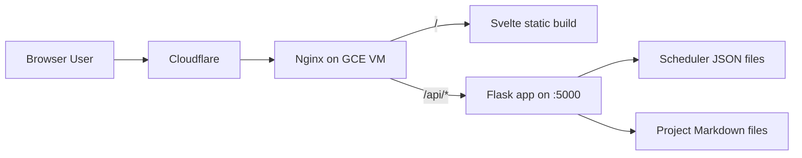

# Architecture

## Project Snapshot

This repository is a full-stack personal website with:

- a Svelte + Vite frontend,
- a Flask backend API,
- Terraform-managed deployment on a single GCP VM behind Cloudflare,
- an interactive class scheduler utility as the primary product feature.

A major architectural improvement moved project write-ups to backend-hosted Markdown so project content can be updated without rebuilding frontend assets.

## Goals

1. Present a clear, public portfolio and project narrative.
2. Ship a technically substantial interactive tool (scheduler).
3. Keep operations simple and low-cost.
4. Support content-only updates without frontend rebuild/redeploy.

## System Topology

## Stack by Layer

### Frontend

- Svelte 5
- TypeScript
- Vite
- page.js client-side router

Responsibilities:

1. Render site routes and page content.
2. Run scheduler UX and prerequisite graph behavior.
3. Fetch and render runtime Markdown project content.

### Backend

- Flask app factory + blueprint routing
- Flask-CORS scoped to `/api/*`
- Waitress in production

Responsibilities:

1. Serve scheduler JSON APIs.
2. Serve published project metadata and Markdown body content.
3. Enforce required environment configuration (`SECRET_KEY`).

### Infrastructure

- Terraform for network/VM/firewall/DNS resources
- Nginx for TLS, static hosting, API proxying
- systemd-managed Flask service
- Cloudflare DNS + proxy

## Repository Layout

- `frontend/`: SPA shell, router, scheduler logic, project rendering pipeline.
- `backend/`: API routes, scheduler data, project content files.
- `deployment/`: Terraform and startup/service templates.
- `documentation/`: architecture, implementation, deployment, and runbook docs.

## Core Runtime Flows

### Page Navigation

1. Router maps URL to page component.
2. Data-heavy routes (scheduler/project detail) trigger async loads.
3. Components switch among loading, error, and ready states.

### Scheduler Flow

1. Frontend fetches `/api/scheduler/default-schedule` and `/api/scheduler/course-data` in parallel.
2. Loader builds in-memory course instances.
3. Scheduler logic computes edge status and requirement progress.
4. UI updates cards, progress indicators, and graph overlays.

### Project Content Flow

1. Frontend fetches `/api/projects` for card/index content.
2. Detail route fetches `/api/projects/:slug` for Markdown payload.
3. Renderer applies GFM parsing, heading anchors, and sanitization.
4. Mermaid diagrams render client-side after DOM update.

## Data and Content Strategy

### Scheduler Data

- Source of truth is JSON in backend static directory.
- Frontend consumes data on demand via API.
- No server-side persistence for user schedule changes yet.

### Project Write-Ups

- Source of truth is Markdown with YAML frontmatter in backend content directory.
- `published` frontmatter controls public visibility.
- Enables rapid editorial iteration without rebuilding frontend.

## Security and Trust Boundaries

1. CORS is scoped to `/api/*` routes.
2. Markdown output is sanitized before frontend injection.
3. Infra secrets are pulled from Secret Manager during provisioning.
4. HTTPS is enforced through Cloudflare + Nginx configuration.

## Notable Tradeoffs

1. Single VM simplicity vs managed-service scalability.
2. Runtime Markdown flexibility vs additional client rendering complexity.
3. Frontend-heavy scheduler logic for responsive UX vs missing server-side persistence.

## Constraints

1. Single-VM topology is a single failure domain.
2. Scheduler data is static and may drift from real-world updates.
3. No account model or saved server-side scheduler state.
4. Test coverage is limited across backend and frontend.

## Next Iterations

1. Add `/api/health` and basic uptime monitoring.
2. Add backend and frontend automated tests for critical flows.
3. Introduce persistent schedule storage.
4. Improve Terraform state/secrets posture for production hardening.
