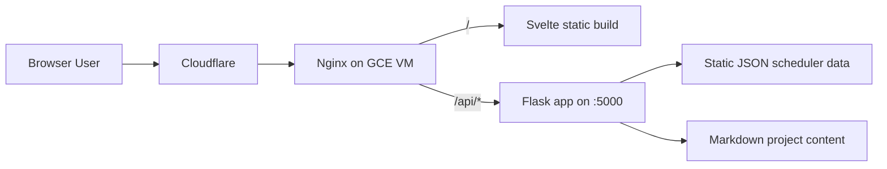

# Project Overview

## What This Repository Is

This is a personal website project with:

- a Svelte + Vite frontend,
- a Flask backend API,
- a Terraform deployment stack on Google Cloud + Cloudflare,
- a class scheduler utility as the most feature-rich part of the application.

## High-Level Architecture

## Repository Structure

- `frontend/`: Svelte single-page application (client-side routing via `page.js`).
- `backend/`: Flask app exposing scheduler data API endpoints.
- `deployment/`: Terraform + startup templates for provisioning and bootstrapping.
- `documentation/`: this documentation set.

## Runtime Responsibilities

- Frontend:
  - renders website pages and utilities,
  - loads scheduler data from backend APIs,
  - computes and visualizes prerequisite graph behavior in-browser.
- Backend:
  - serves scheduler JSON to the frontend,
  - supports CORS under `/api/*`,
  - runs via Flask dev server or Waitress in production.
- Deployment:
  - provisions networking and a VM,
  - installs Python + Node on startup,
  - builds frontend static assets,
  - runs Flask as a systemd service,
  - configures Nginx TLS and reverse proxy,
  - configures Cloudflare DNS A record.

## Main User-Facing Pages

Defined in frontend routing:

- `/`
- `/projects`
- `/projects/:slug`
- `/about`
- `/contact`
- `/utilities`
- `/utilities/scheduler` (and trailing slash variant)

The `/projects/:slug` route is rendered from backend-served markdown content at runtime.

## Key Feature: Class Scheduler

The scheduler supports:

- loading a seeded schedule and course catalog,
- drag-and-drop semester planning,
- prerequisite edge drawing and validation states,
- requirement coverage progress,
- course add/remove interactions,
- import/export of schedule JSON.

Detailed behavior is documented in [scheduler.md](./scheduler.md).
