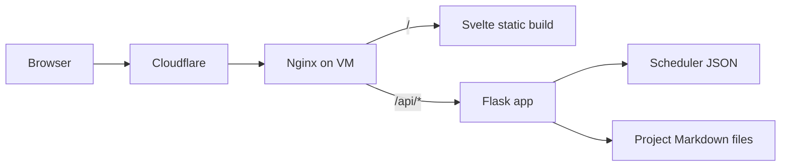

# Personal Website Case Study

## Snapshot

This project is a full-stack personal website that combines a Svelte frontend, a Flask backend, and Terraform-managed deployment on a single GCP VM behind Cloudflare.

The most substantial product feature is an interactive class scheduler utility with prerequisite validation and graph visualization.

Recent architecture work also moved project write-ups to runtime Markdown content so new project pages can be published without rebuilding frontend assets.

## Problem and Goals

The site needed to satisfy three goals at once:

1. Be a public portfolio with clear project storytelling.
2. Host an interactive utility with non-trivial logic (scheduler).
3. Stay operationally simple and low-cost to run.

A fourth requirement emerged during iteration: project content updates should not require rebuilding or redeploying the frontend bundle.

## Architecture Decision Summary

- Frontend: Svelte + TypeScript + page.js for SPA routing and utility UX.
- Backend: Flask API serving scheduler data and project Markdown content.
- Infra: Terraform-provisioned VM with Nginx reverse proxy and systemd service.
- Edge: Cloudflare for DNS and traffic proxy.

High-level request flow:

## Feature Highlights

### Scheduler Utility

- Parallel data fetch from scheduler endpoints.
- Prerequisite graph edge states (`valid`, `invalid`, `concurrent`).
- Drag-and-drop semester planning with manual ordering controls.
- Import/export of schedule JSON.

### Dynamic Project Write-Ups

- Project metadata and body stored in backend Markdown files with frontmatter.
- Frontend renders Markdown at runtime with GFM support.
- Mermaid code fences render client-side on project detail pages.
- Content updates can be made by editing Markdown files on the VM.

## Notable Engineering Tradeoffs

1. Single VM simplicity vs managed service scalability.
2. Runtime Markdown flexibility vs extra client-side rendering complexity.
3. Frontend-heavy scheduler logic for fast UX vs server-side persistence.

## Outcomes

1. End-to-end deployable stack with infra-as-code.
2. Interactive, algorithmic utility suitable for technical portfolio depth.
3. Faster editorial workflow for projects because frontend rebuild is no longer required for content-only updates.

## What I Would Improve Next

1. Add backend and frontend automated tests for critical flows.
2. Add health endpoint and monitoring for operational visibility.
3. Add persistent scheduler storage and optional user accounts.
4. Move Terraform state to remote encrypted backend and complete secret hardening.

## Deep Technical Docs

- [Project Overview](./project-overview.md)
- [Technical Architecture](./technical-architecture.md)
- [API Contracts and Examples](./api-contracts.md)
- [Scheduler Utility Documentation](./scheduler.md)
- [Deployment Documentation](./deployment.md)
- [Operations Runbook](./operations-runbook.md)
- [Known Issues and Recommended Fixes](./known-issues.md)
