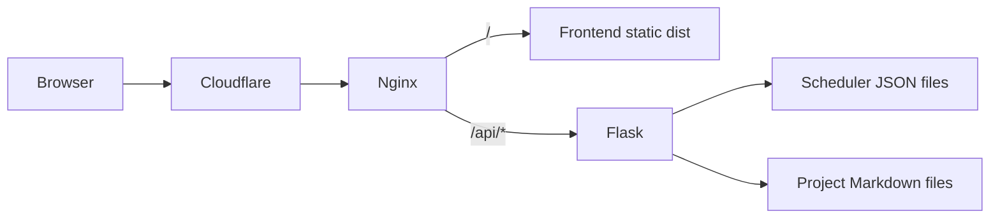

# Technical Architecture

## System Topology

## Stack by Layer

### Frontend

- Svelte 5
- TypeScript
- Vite
- page.js client-side router

Responsibilities:

1. Route rendering for site pages.
2. Scheduler UX and prerequisite graph state.
3. Runtime fetch + rendering for project markdown pages.

### Backend

- Flask app factory + blueprint routing
- Waitress in production
- Flask-CORS scoped to `/api/*`

Responsibilities:

1. Serve scheduler JSON APIs.
2. Serve project metadata and markdown payloads.
3. Validate required environment configuration (`SECRET_KEY`).

### Infrastructure

- Terraform for network, VM, firewall, and Cloudflare DNS records.
- Nginx for TLS, static hosting, and API proxying.
- systemd to run Flask service on VM boot.

## Repository Layout and Ownership

- `frontend/`: UI, client routing, markdown renderer, scheduler logic.
- `backend/`: API routes, scheduler data files, project content files.
- `deployment/`: Terraform and startup/service templates.
- `documentation/`: architecture and operations knowledge base.

## Core Runtime Flows

### Page Navigation

1. SPA router maps path to page components.
2. Utility and project routes trigger async data load.
3. Component state controls loading/error/success rendering.

### Scheduler Flow

1. Frontend fetches `/api/scheduler/default-schedule` and `/api/scheduler/course-data`.
2. Data loader creates in-memory course instances.
3. Logic engine computes edge statuses and progress metrics.
4. UI re-renders graph overlays and status indicators.

### Project Content Flow

1. Frontend fetches `/api/projects` for project index cards.
2. Detail route fetches `/api/projects/:slug` for markdown body.
3. Markdown pipeline applies GFM + heading anchors + sanitization.
4. Mermaid blocks render client-side after DOM update.

## Data and Content Strategy

### Scheduler Data

- Source-of-truth in JSON files inside backend static directory.
- Loaded on demand by frontend; no browser-local seed bundle required.

### Project Write-Ups

- Source-of-truth in backend markdown files with YAML frontmatter.
- Publish/unpublish controlled by `published` frontmatter flag.
- Suitable for rapid content iteration without rebuilding frontend assets.

## Security and Trust Boundaries

1. API CORS scope restricted to `/api/*` routes.
2. Markdown rendering sanitizes generated HTML before injection.
3. Infra secrets pulled from Secret Manager during provisioning.
4. HTTPS traffic terminated via Cloudflare and Nginx configuration.

## Constraints

1. Single-VM deployment concentrates failure domain.
2. Scheduler data is static and may drift from real-world course changes.
3. No persistence layer for user-authored scheduler state.
4. Limited automated testing coverage across backend/frontend.

## Next Architecture Iterations

1. Add `/api/health` and basic uptime telemetry.
2. Add persistence layer for saved schedules.
3. Introduce CI checks for API contracts and frontend runtime rendering.
4. Move Terraform state and secrets handling to a stricter production posture.
